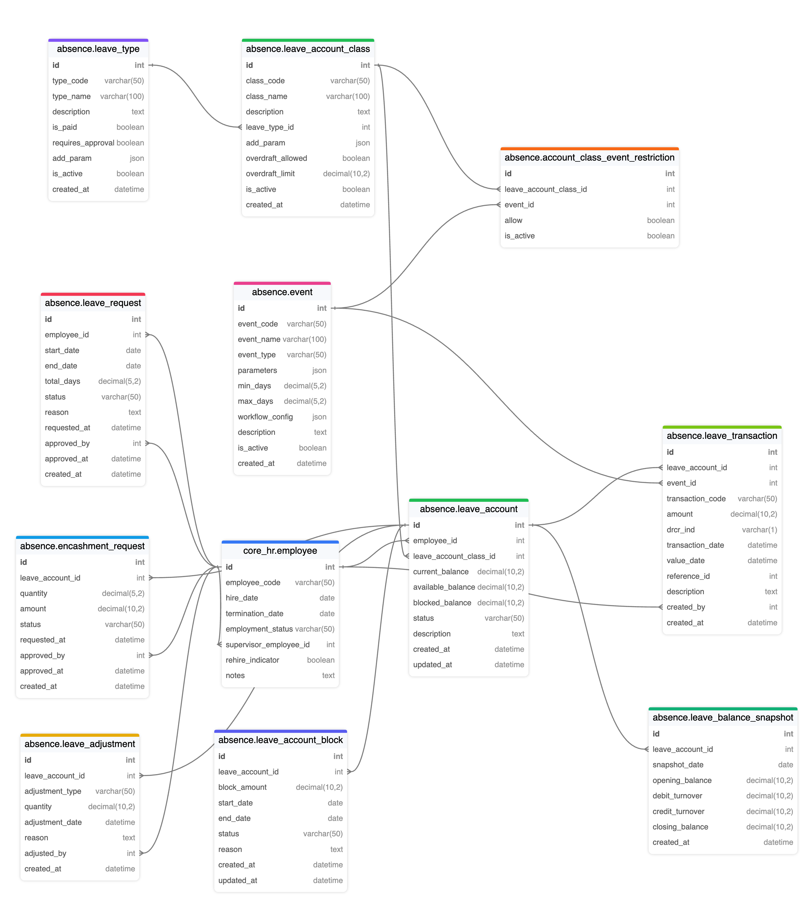

Dưới đây là tài liệu giải thích chi tiết mô hình thiết kế **Absence Management** dựa trên DBML bạn đã cung cấp. Tài liệu này nhằm phục vụ cả mục đích làm tài liệu sản phẩm (giới thiệu mô hình và ý nghĩa nghiệp vụ) cũng như làm tài liệu tham khảo cho nhóm phát triển (mô tả các bảng, quan hệ, ý nghĩa từng cột dữ liệu).

---

## I. Tổng quan

Module **Absence Management** (Quản lý Nghỉ phép) cho phép quản lý các loại nghỉ phép (annual leave, sick leave, v.v.), bao gồm:

1. **Định nghĩa loại nghỉ phép** (Leave Type).  
2. **Quản lý lớp tài khoản nghỉ phép** (Leave Account Class) và các hạn chế sự kiện áp dụng trên lớp tài khoản đó.  
3. **Quản lý tài khoản nghỉ phép của nhân viên** (Leave Account).  
4. **Các giao dịch phát sinh** (Leave Transaction) khi cộng/ trừ số dư nghỉ phép.  
5. **Các yêu cầu nghỉ phép**, điều chỉnh, encashment,...  
6. **Snapshot / Báo cáo** để lưu lịch sử số dư tài khoản hàng ngày hoặc tại các thời điểm nhất định.  
7. **Khả năng “Block”** một phần số dư nghỉ phép, tránh việc sử dụng trùng lặp khi cần phê duyệt.  

Mô hình này được xây dựng tương tự cách quản lý tài khoản ngân hàng (với concept debit/credit, transaction, snapshot, block,...).  

---

## II. Lưu đồ tổng quan và luồng nghiệp vụ

1. **Nhân viên** được cấp một hoặc nhiều **tài khoản nghỉ phép** (Leave Account) tương ứng với các **lớp tài khoản** (Leave Account Class) khác nhau (VD: Tài khoản Nghỉ Phép Năm, Tài khoản Nghỉ Ốm...).  

2. Mỗi **tài khoản nghỉ phép** quản lý số dư (current_balance, available_balance) và cho phép chặn (block) một phần số dư tạm thời (blocked_balance).  

3. Bất kỳ **sự kiện** (Event) nào xảy ra dẫn đến việc thay đổi số dư thì tạo ra **giao dịch** (Leave Transaction). Mỗi transaction có thể debit/credit số dư và được lưu lại để audit.  

4. Một **Leave Request** (yêu cầu nghỉ phép) có thể dẫn đến:  
   - Tạo trước block cho số ngày nghỉ cần duyệt.  
   - Khi được duyệt, hệ thống sẽ ghi nhận transaction trừ số dư.  

5. Các **Adjustments** (điều chỉnh), **Encashment Requests** (quy đổi ngày phép ra tiền) cũng tạo transaction.  

6. Định kỳ hoặc theo sự kiện, hệ thống có thể ghi nhận **Leave Account Snapshot** để chụp lại trạng thái số dư.  

---

## III. Chi tiết bảng và ý nghĩa cột

### 1. **Bảng `core_hr.employee`**

- **Mục đích**: Lưu trữ thông tin nhân viên cốt lõi (bên module Core HR).  
- **Các cột quan trọng**:  
  - `employee_code`: Mã định danh nhân viên.  
  - `hire_date`: Ngày bắt đầu làm việc.  
  - `termination_date`: Ngày kết thúc hợp đồng (nếu có).  
  - `supervisor_employee_id`: Tham chiếu đến nhân viên quản lý trực tiếp.  
  - `rehire_indicator`: Cờ cho biết nhân viên có được tái thuê hay không.  

#### Mối quan hệ
- Là bảng cha/ trung tâm để tham chiếu khi cần biết nhân viên nào đang sở hữu tài khoản nghỉ phép, tạo giao dịch, phê duyệt yêu cầu,...

---

### 2. **Bảng `absence.leave_type`**

- **Mục đích**: Định nghĩa các loại nghỉ phép (Vacation, Sick Leave, Maternity Leave, v.v.).  
- **Các cột chính**:  
  - `type_code`, `type_name`: Mã và tên loại nghỉ.  
  - `is_paid`: Cho biết loại nghỉ này có được trả lương hay không.  
  - `requires_approval`: Cờ cho biết liệu yêu cầu nghỉ loại này có cần phê duyệt.  
  - `add_param`: Có thể lưu trữ các tham số mở rộng (dưới dạng JSON).  

#### Mối quan hệ
- Được tham chiếu bởi `leave_account_class` (mỗi class sẽ gắn với một loại nghỉ phép cụ thể, ví dụ Annual Leave Class thuộc loại Vacation,...).  

---

### 3. **Bảng `absence.leave_account_class`**  
*(Trước đây là `leave_class`)*

- **Mục đích**: Quản lý “lớp tài khoản” nghỉ phép. Một loại nghỉ phép (VD: Vacation) có thể có nhiều “class” khác nhau (VD: Annual Leave Account cho nhân viên chính thức, Annual Leave Account cho nhân viên bán thời gian,...).  
- **Các cột chính**:  
  - `class_code`, `class_name`: Mã và tên lớp tài khoản.  
  - `leave_type_id`: Liên kết sang `leave_type`.  
  - `overdraft_allowed`, `overdraft_limit`: Cho biết có cho phép tài khoản bị thấu chi hay không, và giới hạn thấu chi bao nhiêu.  
  - `add_param`: Trường JSON để cấu hình khác.  

#### Mối quan hệ
- Một `leave_account_class` sẽ quy định các quy tắc chung cho `leave_account` tạo ra từ nó (như overdraft, param,...).  
- Liên kết với `absence.account_class_event_restriction` để quy định event được/ không được phép.  

---

### 4. **Bảng `absence.account_class_event_restriction`**  
*(Trước đây là `class_event_restriction`)*

- **Mục đích**: Quản lý cho phép/không cho phép một **event** nhất định áp dụng trên một **leave_account_class** cụ thể. Ví dụ: Có class không cho phép event “Encashment” (chuyển đổi ngày phép thành tiền).  
- **Các cột chính**:  
  - `leave_account_class_id`: Tham chiếu đến lớp tài khoản.  
  - `event_id`: Tham chiếu đến bảng `absence.event`.  
  - `allow`: Cờ `true` / `false` cho biết có được phép hay không.  

---

### 5. **Bảng `absence.event`**

- **Mục đích**: Định nghĩa tất cả các “sự kiện” có thể xảy ra trên tài khoản nghỉ (VD: ACCRUAL – cộng ngày phép hàng tháng, CARRYOVER – chuyển tồn cuối năm, LEAVE_REQUEST – yêu cầu nghỉ, ENCASHMENT – quy đổi tiền,...).  
- **Các cột chính**:  
  - `event_code`, `event_name`: Mã và tên sự kiện.  
  - `event_type`: Phân loại sự kiện (Accrual, Carryover, Leave Request, Encashment, Adjustment,...).  
  - `parameters`: JSON chứa tham số tùy chọn (VD: “mỗi tháng accrual 1.5 ngày”).  
  - `min_days`, `max_days`: Cấu hình giới hạn số ngày cho sự kiện.  
  - `workflow_config`: JSON quy định logic phê duyệt, luồng workflow.  
  - `description`: Mô tả thêm.  

#### Mối quan hệ
- Tham chiếu trong `account_class_event_restriction` để xác định có được phép hay không.  
- Tham chiếu trong `leave_transaction` để cho biết giao dịch được sinh ra bởi event nào.  

---

### 6. **Bảng `absence.leave_account`**  
*(Trước đây là `leave_balance`)*

- **Mục đích**: Tạo “tài khoản nghỉ phép” cụ thể cho **một nhân viên** thuộc **một lớp tài khoản**.  
- **Các cột chính**:  
  - `employee_id`: Thuộc về nhân viên nào.  
  - `leave_account_class_id`: Thuộc về lớp tài khoản nào.  
  - `current_balance`: Số dư hiện tại.  
  - `available_balance`: Số dư khả dụng (đã trừ phần block).  
  - `blocked_balance`: Số dư đang bị chặn/ block.  
  - `status`: Trạng thái tài khoản (Active, Inactive,...).  

#### Mối quan hệ
- Đây là bảng trung tâm ghi nhận số dư nghỉ phép cho nhân viên.  
- Được tham chiếu bởi `leave_transaction`, `leave_request`, `leave_adjustment`, `encashment_request`, v.v...  

---

### 7. **Bảng `absence.leave_transaction`**

- **Mục đích**: Lưu các bút toán (credit/debit) khi số dư của tài khoản nghỉ thay đổi.  
- **Các cột chính**:  
  - `leave_account_id`: Tài khoản bị tác động.  
  - `event_id`: Loại sự kiện phát sinh giao dịch.  
  - `transaction_code`: Mã giao dịch (nếu cần).  
  - `amount`: Số ngày nghỉ được cộng (+) hoặc trừ (-).  
  - `drcr_ind`: Debit/Credit.  
  - `transaction_date`: Ngày giao dịch.  
  - `value_date`: Ngày giá trị (có thể khác ngày giao dịch).  
  - `reference_id`: Tham chiếu sang yêu cầu nghỉ, adjustment,... nếu cần.  
  - `description`: Nội dung giao dịch.  
  - `created_by`: Ai tạo giao dịch này (có thể là HR admin,...).  

#### Mối quan hệ
- Giao dịch ảnh hưởng đến bảng `leave_account` (chỉnh sửa `current_balance`, `available_balance`).  
- Kết hợp với `event_id` để hiểu được logic nghiệp vụ (ví dụ, event = ACCRUAL).  

---

### 8. **Bảng `absence.leave_request`**

- **Mục đích**: Lưu trữ yêu cầu nghỉ phép của nhân viên.  
- **Các cột chính**:  
  - `employee_id`: Ai yêu cầu nghỉ.  
  - `start_date`, `end_date`: Ngày bắt đầu, kết thúc nghỉ.  
  - `total_days`: Tổng số ngày xin nghỉ.  
  - `status`: Trạng thái (Requested, Approved, Rejected, Cancelled).  
  - `reason`: Lý do nghỉ.  
  - `requested_at`: Thời điểm yêu cầu.  
  - `approved_by`, `approved_at`: Ai và khi nào phê duyệt.  

#### Mối quan hệ
- Khi được duyệt, có thể tạo transaction (nếu business logic yêu cầu).  
- Có thể block trước một phần số dư khi request, sau đó release block hoặc trừ hẳn khi approve.  

---

### 9. **Bảng `absence.leave_adjustment`**

- **Mục đích**: Ghi nhận các điều chỉnh thủ công (Manual Adjustment) hoặc điều chỉnh do sai sót (Correction).  
- **Các cột chính**:  
  - `leave_account_id`: Tài khoản bị điều chỉnh.  
  - `adjustment_type`: Loại điều chỉnh (Manual, Correction,...).  
  - `quantity`: Số ngày điều chỉnh (có thể + hoặc -).  
  - `adjustment_date`: Ngày thực hiện điều chỉnh.  
  - `reason`: Lý do điều chỉnh.  
  - `adjusted_by`: Ai thực hiện điều chỉnh.  

#### Mối quan hệ
- Thường sau khi điều chỉnh sẽ tạo ra một `leave_transaction` tương ứng để cập nhật số dư tài khoản.  

---

### 10. **Bảng `absence.encashment_request`**

- **Mục đích**: Quản lý yêu cầu quy đổi ngày phép thành tiền (Encashment).  
- **Các cột chính**:  
  - `leave_account_id`: Tài khoản nghỉ phép muốn encash.  
  - `quantity`: Số ngày nghỉ muốn quy đổi.  
  - `amount`: Số tiền tương ứng.  
  - `status`: Requested, Approved, Rejected.  
  - `requested_at`, `approved_by`, `approved_at`: Lưu thông tin phê duyệt.  

#### Mối quan hệ
- Sau khi phê duyệt, tạo transaction trừ ngày phép (`leave_transaction`).  
- Có thể liên quan đến bảng tính lương nếu ta muốn chi trả.  

---

### 11. **Bảng `absence.leave_balance_snapshot`**

- **Mục đích**: Chụp lại lịch sử số dư tài khoản tại thời điểm nhất định để phục vụ báo cáo, đối soát.  
- **Các cột chính**:  
  - `leave_account_id`: Tài khoản được chụp.  
  - `snapshot_date`: Ngày chụp snapshot (mặc định `current_date`).  
  - `opening_balance`, `debit_turnover`, `credit_turnover`, `closing_balance`: Mô phỏng mô hình “bank statement”.  
    - `opening_balance`: Số dư đầu ngày.  
    - `debit_turnover`: Tổng số lượng debit (ngày phép bị trừ) trong ngày.  
    - `credit_turnover`: Tổng số lượng credit (ngày phép được cộng) trong ngày.  
    - `closing_balance`: Số dư cuối ngày.  

#### Mối quan hệ
- Không bắt buộc online, nhưng thường được cập nhật định kỳ hoặc khi chạy batch.  

---

### 12. **Bảng `absence.leave_account_block`**

- **Mục đích**: Quản lý việc “chặn” (block) một phần số dư nghỉ phép cho một mục đích cụ thể, ví dụ chờ phê duyệt nghỉ dài ngày, cọc cho “tài khoản”,...  
- **Các cột chính**:  
  - `leave_account_id`: Tài khoản nào bị block.  
  - `block_amount`: Số ngày nghỉ bị block.  
  - `start_date`, `end_date`: Thời gian block (nếu có).  
  - `status`: Trạng thái block (Active, Released,...).  
  - `reason`: Lý do block.  

#### Mối quan hệ
- Khi block, `blocked_balance` của `leave_account` sẽ tăng. Ngược lại, `available_balance` sẽ giảm.  
- Khi “release” block, phải cập nhật lại `blocked_balance` và `available_balance`.  

---

## IV. Cách thức vận hành (use case mẫu)

1. **Cấp tài khoản nghỉ cho nhân viên**:  
   - Khi nhân viên A được tuyển, hệ thống tạo `leave_account` cho nhân viên A dựa trên các `leave_account_class` áp dụng (VD: Tạo Annual Leave Account).  
   - `current_balance` ban đầu có thể là 0 hoặc theo chính sách.  

2. **Tự động cộng ngày phép hàng tháng (Accrual)**:  
   - Một event `ACCRUAL` được chạy hàng tháng.  
   - Mỗi `leave_account` đủ điều kiện, hệ thống sẽ tạo ra một `leave_transaction` (credit).  
   - Số dư `current_balance` và `available_balance` tăng lên.  

3. **Nhân viên yêu cầu nghỉ (Leave Request)**:  
   - Nhân viên A gửi request (start_date, end_date, total_days).  
   - Hệ thống có thể tạm block `total_days` trên tài khoản.  
   - Khi được duyệt, transaction debit số dư để trừ ngày phép (và unblock nếu cần).  

4. **Điều chỉnh thủ công**:  
   - Admin HR phát hiện sai sót, tạo `leave_adjustment`.  
   - Hệ thống tự sinh `leave_transaction` để cập nhật số dư.  

5. **Chụp snapshot cuối tháng**:  
   - Hệ thống chạy job, ghi vào `leave_balance_snapshot` cho mỗi `leave_account`.  

---

## V. Hướng dẫn mở rộng / tùy chỉnh

- **Overdraft**: Cho phép `overdraft_allowed = true` và thiết lập `overdraft_limit` để tài khoản có thể bị âm, với giới hạn âm bao nhiêu.  
- **Workflow phê duyệt**: Sử dụng `workflow_config` trong `absence.event` để tham chiếu đến luồng phê duyệt tùy vào `min_days`, `max_days`,...  
- **Restriction**: Bảng `account_class_event_restriction` cho phép tùy chỉnh event được áp dụng trên mỗi class.  
- **Encashment**: Tích hợp với module Payroll nếu muốn trả tiền trực tiếp.  

---

## VI. Tóm tắt và lợi ích

- **Mô hình “banking-like”** giúp quản lý ngày nghỉ như quản lý tài khoản với các bút toán nợ/ có rõ ràng.  
- **Dễ dàng mở rộng** sang các trường hợp “block”, “encashment”, “carryover” hay “accrual” định kỳ.  
- **Kiến trúc linh hoạt**: Tách biệt khái niệm `leave_type`, `leave_account_class` và `leave_account` giúp mô-đun dễ cấu hình cho nhiều chính sách nghỉ của doanh nghiệp.  
- **Audit rõ ràng**: Giao dịch (`leave_transaction`) và snapshot (`leave_balance_snapshot`) hỗ trợ theo dõi biến động số dư, đối chiếu lịch sử.  

---

## VII. Kết luận

Thiết kế module **Absence Management** này cho phép quản lý toàn diện việc nghỉ phép của nhân viên, hỗ trợ nhiều tính năng nâng cao như overdraft, block số dư, encashment, và tích hợp workflow phê duyệt. Tất cả được xây dựng trên cơ sở hạ tầng “banking-like”, giúp kế thừa mô hình tài khoản – giao dịch – đối soát quen thuộc, đảm bảo linh hoạt khi phát triển, mở rộng và tích hợp với các module khác (Payroll, Workflow, Core HR...).  

Tài liệu này có thể được sử dụng bởi:
- **Nhà quản lý sản phẩm (Product Owner)**: Hiểu tổng quan mô hình và khả năng cấu hình.  
- **Nhóm phát triển (Developers)**: Hiểu chi tiết từng bảng, cột, logic quan hệ.  
- **Nhóm QA/Tester**: Kiểm thử từng tính năng nghiệp vụ và tính toàn vẹn của dữ liệu.  

--- 

**Hết**  