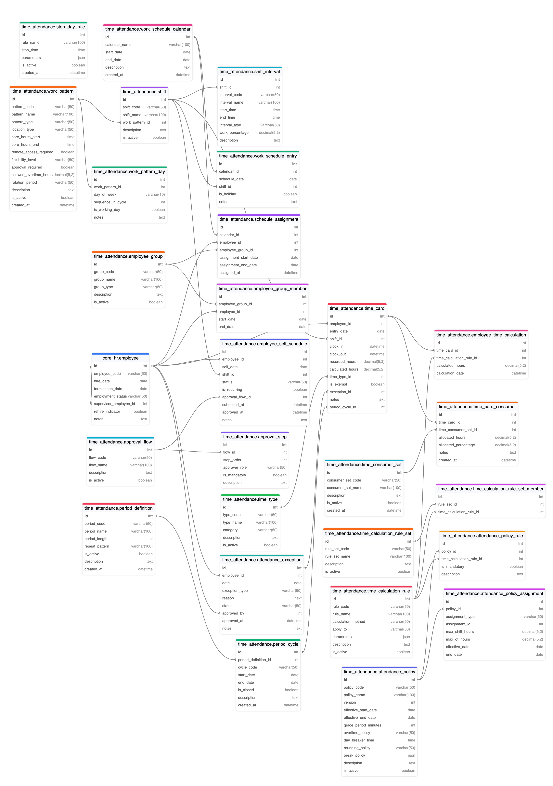

Dưới đây là **tài liệu giới thiệu khái niệm (concept) và cấu trúc mô-đun Time & Attendance**. Mục tiêu là giúp **hiểu rõ logic** và **mối quan hệ** giữa các thực thể (entity), từ đó phục vụ cho việc cấu hình, triển khai các use case thực tế. Tài liệu **không đi quá sâu** vào chi tiết mọi cột, mà chủ yếu **giới thiệu các cột quan trọng** và **diễn giải ý nghĩa** của từng bảng.

## I. Tổng quan khối **Core HR**

### 1. `core_hr.employee`
- **Ý nghĩa**: Thông tin nhân viên (chung trong hệ thống).  
- **Vai trò**: Tất cả dữ liệu chấm công, lịch làm việc… đều tham chiếu đến nhân viên.  
- **Thông tin cốt lõi**: `employee_code` (mã nhân viên), `employment_status`, `hire_date`/`termination_date`.  

## II. Khối **Time & Attendance** (Chính)

Dưới đây là **các nhóm entity** phục vụ quản lý thời gian, chấm công, ca kíp, chính sách…

### 1. **Time Card** và liên quan

#### 1.1. `time_attendance.time_card`
- **Mục đích**: Lưu dữ liệu chấm công gốc (giống “Time Entry” trong Oracle T&L).  
- **Các cột quan trọng**:  
  - `employee_id`: Người nào chấm công.  
  - `clock_in`, `clock_out`: Thời gian bắt đầu/kết thúc (có thể do máy chấm công ghi lại).  
  - `recorded_hours`: Số giờ “thô” ghi nhận.  
  - `calculated_hours`: Số giờ “sau khi tính toán” (vd: có rounding, trừ break, OT...).  
  - `time_type_id`: Loại thời gian (Regular, Overtime, Absence…).  
  - `period_cycle_id`: Để biết Time Card này thuộc “kỳ chấm công” nào (nếu dùng khái niệm period).  

#### 1.2. `time_attendance.time_type`
- **Mục đích**: Phân loại giờ làm (Regular, OT, Sick Leave…).  
- **Ý nghĩa**: Giúp xác định “Time Card” thuộc nhóm giờ nào, có tính lương hay không…

#### 1.3. `time_attendance.attendance_exception`
- **Mục đích**: Lưu các “ngoại lệ” so với lịch chuẩn (VD: đi muộn, về sớm, no-show…).  
- **Cách sử dụng**: Time Card có thể link đến một “exception” nếu nhân viên vi phạm, cần phê duyệt…

### 2. **Time Calculation** (Tính công, tính giờ)

#### 2.1. `time_attendance.time_calculation_rule`
- **Mục đích**: Khai báo các quy tắc tính (OT sau 8h, Hourly, Premium pay, v.v.).  
- **Cột quan trọng**:  
  - `calculation_method`: Cách tính (Hourly, Daily, Overtime, Premium…).  
  - `apply_to`: Áp dụng cho đối tượng nào (Shift, Time Type, Employee Group…).  
  - `parameters`: JSON chứa logic nâng cao (vd: ngưỡng 8h, hệ số 1.5 OT…).

#### 2.2. (Tuỳ chọn) `time_calculation_rule_set` và `time_calculation_rule_set_member`
- **Mục đích**: Gom nhiều rule thành 1 bộ (Set).  
- **Dùng khi**: Một chính sách hoặc một phòng ban được áp nhiều rule đồng thời.

#### 2.3. `time_attendance.employee_time_calculation`
- **Mục đích**: Lưu lại **kết quả** áp từng rule lên 1 Time Card (giúp truy xuất, report).  
- **Ví dụ**: Time Card #123 được áp Rule “OT after 8h” => `calculated_hours = 2h OT`.

### 3. **Attendance Policy & Assignment**

#### 3.1. `time_attendance.attendance_policy`
- **Mục đích**: Định nghĩa **chính sách chấm công** (Grace period, OT policy, rounding…).  
- **Một số cột nổi bật**:  
  - `grace_period_minutes`: Trễ bao nhiêu phút thì vẫn coi như đúng giờ.  
  - `overtime_policy`: Cách xử lý OT (“After Scheduled Hours”, “Approval Required”…).  
  - `day_breaker_time`: Giờ cắt ngày (VD: 02:00 AM).  
  - `rounding_policy`: Quy tắc làm tròn giờ.  
  - `break_policy`: Lưu chi tiết nghỉ giữa ca (JSON).

#### 3.2. `time_attendance.attendance_policy_rule` (Tuỳ chọn)
- **Mục đích**: Liên kết 1 policy với nhiều “calculation rule” cụ thể.

#### 3.3. `time_attendance.attendance_policy_assignment`
- **Mục đích**: Xác định **policy** nào áp cho **đối tượng** nào (công ty, phòng ban, nhân viên, nhóm…).  
- **Cột bổ sung**: `max_shift_hours`, `max_ot_hours` cũng có thể đặt ở đây (giới hạn thời gian làm việc theo policy).

### 4. **Shift & Work Pattern**

#### 4.1. `time_attendance.shift`
- **Mục đích**: Mô tả một “ca” làm việc (Ca Sáng, Ca Đêm…).  
- **Cột**: `shift_code`, `shift_name`. Có thể link đến `work_pattern` nếu ca thuộc pattern nào.

#### 4.2. `time_attendance.shift_interval`
- **Mục đích**: Chia 1 ca thành các đoạn (Work, Break, Meal, Flex...).  
- **Ví dụ**: Ca Sáng 8h-12h (Work), 12h-13h (Meal), 13h-17h (Work).

#### 4.3. `time_attendance.work_pattern`
- **Mục đích**: Khái niệm “mẫu” hoặc “chuỗi” làm việc (Fixed, Flexible, Rotational).  
- **Cột**: `core_hours_start`, `core_hours_end`, `rotation_period` (VD: 3 ca 4 kíp…).  
- **Dành cho**: Tạo logic ca xoay, remote/hybrid…

#### 4.4. `time_attendance.work_pattern_day`
- **Mục đích**: Chi tiết hóa ngày làm/ngày nghỉ trong 1 pattern.  
- **Có thể** dùng `day_of_week` (Monday…) hoặc `sequence_in_cycle` (nếu xoay 28 ngày…).

### 5. **Work Schedule & Assignment**

#### 5.1. `time_attendance.work_schedule_calendar` + `work_schedule_entry`
- **Mục đích**: Thể hiện **lịch chi tiết** (calendar) từng ngày (có thể dùng thay cho pattern).  
- **Ví dụ**: Calendar Tháng 1/2024, mỗi ngày link 1 shift, hoặc đánh dấu holiday…

#### 5.2. `time_attendance.schedule_assignment`
- **Mục đích**: Gán 1 nhân viên (hoặc group) vào 1 lịch, thời hạn cụ thể.  
- **Qua đó**: Hệ thống biết người A dùng calendar X từ ngày 01/01 – 31/03…

### 6. **Employee Group & Self-Schedule**

#### 6.1. `time_attendance.employee_group` & `time_attendance.employee_group_member`
- **Mục đích**: Tạo, quản lý nhóm nhân viên (theo dự án, phòng ban, team).  
- **Dễ gán** policy, schedule hoặc rule chung cho cả nhóm.

#### 6.2. `time_attendance.employee_self_schedule`
- **Mục đích**: Cho phép nhân viên **tự đăng ký ca** (self-service), gửi lên để “Approved” hay “Rejected”.  
- **Cột**: `status` (Draft, Submitted, Approved…), `approval_flow_id` (nếu có quy trình phê duyệt).

### 7. **Phê duyệt (Approval Flow)**

#### 7.1. `time_attendance.approval_flow` + `approval_step`
- **Mục đích**: Mô tả quy trình duyệt, ai duyệt trước, vai trò phê duyệt…  
- **Dùng cho**: Time Card (nếu cần), Self-Schedule, Exception…

## III. Khối **Time Period** & Time Consumer

### 1. **Period Definition & Period Cycle**

- **`period_definition`**: Định nghĩa **mẫu** chu kỳ (Weekly, Bi-weekly, Monthly...).  
- **`period_cycle`**: Các **instance** cụ thể. Ví dụ: “2024W01” (tuần 1 năm 2024), start_date=01/01 - end_date=07/01.  
- **Time Card** có `period_cycle_id` để biết thuộc kỳ nào, hỗ trợ chốt sổ, tính lương…

### 2. **Time Consumer Set** + `time_card_consumer`
- **Mục đích**: Xác định **dữ liệu thời gian** được “tiêu thụ” (Payroll, Absence, Project...).  
- **`time_card_consumer`**: Cho phép 1 Time Card **chia nhỏ** (VD: 2h sang Overtime, 6h Regular) hoặc “N-N” (Payroll + Project Costing).

## IV. Bảng “Stop Day Rule” (Tuỳ chọn)

- **`stop_day_rule`**: Mô tả “Day Breaker” (cắt ngày sau 2:00 AM). Có thể link sang policy hoặc rule.  
- **Dùng khi** ca làm “vắt” qua nửa đêm, cần chia giờ sang “ngày mới” theo 1 mốc nhất định.

## V. Tóm tắt luồng chính (High-Level)

1. **Cấu hình**: Tạo `time_type`, `time_calculation_rule`, `attendance_policy`, `shift`, `work_pattern`...  
2. **Thiết lập lịch**: Có thể dùng `work_schedule_calendar` hoặc `work_pattern_day`.  
3. **Gán lịch**: `schedule_assignment` -> gán nhân viên A vào calendar/pattern B.  
4. **Chấm công**: Sinh `time_card` (clock_in/clock_out).  
5. **Áp rule**: Hệ thống đọc “attendance_policy” + “time_calculation_rule” => Tính OT, rounding… => Lưu kết quả vào `employee_time_calculation`.  
6. **Phân bổ**: Dùng `time_card_consumer` nếu cần chia “giờ” sang Payroll, Absence, Dự án…  
7. **Phê duyệt** (nếu cần): Dùng “approval_flow”.  
8. **Chốt kỳ**: Tham chiếu `period_cycle` (VD: tuần 1/2024) -> Khoá Time Card.

## VI. Kết luận

Mô hình **Time & Attendance** gồm **nhiều khối** (Time Card, Calculation Rules, Policies, Scheduling…) cho phép:

- Quản lý **đa dạng ca kíp** (cố định, xoay vòng, dài hạn…).  
- Áp dụng **chính sách tính công linh hoạt** (OT, Premium Pay, Grace Period…).  
- Tích hợp với **Core HR** (Employee, Group), **period-based** (chu kỳ chấm công), và **time consumer** (Payroll, Absence...).  
- Dễ mở rộng (Self-Schedule, Approval Flow, Stop Day Rule...).

Các bảng, cột đã được thiết kế đủ linh hoạt để đáp ứng nhiều **use case** phức tạp, nhưng vẫn tách bạch rõ ràng để **triển khai theo nhu cầu** (những phần “tuỳ chọn” có thể dùng hoặc không). Đây là **phương án** sát với logic quản lý thời gian (Time & Labor) phổ biến trong các giải pháp HCM hiện đại.

---

Dưới đây là **tài liệu** giải thích khái niệm (concept) của mô-đun **Time & Attendance**, trình bày **theo trình tự cấu hình** từ cơ bản đến nâng cao. Tài liệu này giúp bạn:

1. Hiểu luồng cấu hình: Từ Work Pattern, Work Pattern Day → Period, Schedule → Shift, Shift Interval → Assign cho Employee → Policy, Rule...  
2. Nắm rõ **cơ chế** và **ý nghĩa** của từng “thực thể” (entity), cũng như **cách sắp xếp** logic để triển khai.

# 1. Khởi điểm: Work Pattern

**Work Pattern** là **mẫu** (pattern) để mô tả dạng lịch làm việc (ví dụ: Cố định 5 ngày/tuần, Luân phiên 3 ca, Remote…).

- **pattern_code, pattern_name**: Định danh mẫu.  
- **pattern_type**: Cho biết loại (Fixed, Flexible, Rotational...).  
- **location_type**: Onsite, Remote, Hybrid…  
- **core_hours_start / core_hours_end** (nếu muốn ràng buộc giờ chính).  
- **rotation_period** (nếu là xoay ca, ví dụ 7 ngày/14 ngày).  
- **approval_required**: Có cần phê duyệt khi đổi lịch không?

Sau khi **tạo** Work Pattern, ta đã có **“khung”** mô tả **tổng thể**.

# 2. Work Pattern Day

Để hoàn thiện một Work Pattern, chúng ta cần định nghĩa **Work Pattern Day** – tức là **chi tiết các ngày** trong một chu kỳ:

- **day_of_week** (nếu áp dụng tuần cố định: Monday, Tuesday...).  
- **sequence_in_cycle** (nếu áp dụng chu kỳ dài hơn 7 ngày, ví dụ 28 ngày, 4 tuần, 3 tháng...).  
- **is_working_day**: true/false (là ngày làm việc hay nghỉ).  
- **notes** (ghi chú nếu có ngoại lệ…).

Ví dụ:  
- Pattern “3 tuần làm – 1 tuần nghỉ”: Ta cấu hình `sequence_in_cycle` = 28. Trong đó, ngày 1 → 21 = làm việc, ngày 22 → 28 = nghỉ.  
- Pattern “5 ngày làm/ 2 ngày nghỉ” mỗi tuần: day_of_week = Monday–Friday (true), Saturday–Sunday (false).

Kết hợp “Work Pattern” + “Work Pattern Day” sẽ cho ta **cấu trúc** lịch **chuẩn** trước khi áp vào thực tế.

# 3. Period Definition & Period Cycle

## 3.1. Period Definition

- **Định nghĩa** cách chia các kỳ (Tuần, 2 Tuần, Tháng...).  
- **period_code** (WEEKLY, BIWEEKLY, MONTHLY...), **period_length** (7, 14, 30…), **repeat_pattern** (“Starts Monday”...).

## 3.2. Period Cycle

- Dựa trên **Period Definition**, hệ thống **sinh ra** các chu kỳ thực tế, ví dụ: “2024W01” (từ ngày 01/01/2024 đến 07/01/2024).  
- **is_closed**: Đánh dấu đã “chốt” kỳ chưa.

**Mục đích**: Giúp bạn “đóng” Time Card, tính công, hoặc “khóa sổ” theo tuần/tháng. Mỗi **Time Card** có thể gắn `period_cycle_id`, hệ thống biết “Time Card này thuộc kỳ 2024W01”.

# 4. Tạo Shift & Shift Interval

## 4.1. Shift

- **Shift** mô tả **ca làm việc** (Ca Sáng, Ca Chiều, Ca Đêm…).  
- **shift_code, shift_name**, link với `work_pattern_id` nếu ca này thuộc pattern nào.

## 4.2. Shift Interval

- Mỗi Shift có thể tách ra **các khoảng** (Work, Meal, Break…).  
- Ví dụ: Ca Sáng 8:00-12:00 (Work), 12:00-13:00 (Meal), 13:00-17:00 (Work).  
- Giúp **chia nhỏ** ca để tính giờ làm, giờ nghỉ chính xác.

**Khi** bạn có Work Pattern “3 ca xoay”, bạn tạo Shift “Ca 1 (6h-14h), Ca 2 (14h-22h), Ca 3 (22h-6h)” và chi tiết Interval bên trong, nếu cần.

# 5. Lập Schedule (Calendar) & Assign

Đến giai đoạn **áp** Work Pattern, Shift… cho **nhân viên**:

## 5.1. Work Schedule Calendar

- Tùy trường hợp, bạn có thể **tạo** `work_schedule_calendar` đại diện cho **lịch** (ví dụ: Tháng 1/2024).  
- Trong đó, `work_schedule_entry` xác định mỗi ngày **sử dụng** Shift nào, có phải ngày nghỉ lễ không...

## 5.2. Schedule Assignment

- **Gán** nhân viên (hoặc Group) vào **Calendar** này, với khung ngày bắt đầu/kết thúc.  
- Hoặc **nếu dùng Work Pattern Day** (mặc định weekly), bạn vẫn cần “Assign pattern” cho nhân viên.

Kết quả: Mỗi nhân viên sẽ có **lịch** (schedule) rõ ràng – **theo pattern** (tự động lặp) hoặc **calendar** (thủ công từng ngày).

# 6. Time Card (Chấm công)

Sau khi đã có **lịch**, nhân viên **chấm công**:

- **Time Card** ghi lại `clock_in`, `clock_out`.  
- Tự động hay thủ công nhập `recorded_hours`.  
- Link `shift_id` (nếu trong ngày đó làm ca nào).  
- Có thể gắn `time_type_id` (Regular, OT, Absence…).

**Hệ thống** căn cứ theo `work_schedule_calendar` hoặc `work_pattern_day` để kiểm tra sai lệch (nếu có). Nếu có vi phạm (đi muộn, quá giờ…), tạo ra `attendance_exception`.

# 7. Time Calculation (Rules, Policy…)

## 7.1. Time Calculation Rule

- **Định nghĩa** quy tắc tính giờ (VD: Overtime sau 8h, Premium 200%...).  
- `calculation_method` (Hourly, Daily, Overtime...)  
- `parameters`: JSON để lưu chi tiết logic (ngưỡng OT, hệ số…).  
- `apply_to`: Có thể giới hạn rule áp cho Shift nào, Time Type nào, hoặc Group nào.

## 7.2. (Tuỳ chọn) Rule Set

- Gom nhiều rule thành **1 set**.  
- Áp set này cho 1 policy hoặc 1 nhóm.

## 7.3. Attendance Policy

- **Tập trung** các chính sách chung (Grace period, Overtime policy, Day Breaker...).  
- `break_policy`: Lưu chi tiết nghỉ giữa ca, có trả lương hay không…  
- **Versioning**: Mỗi policy có version, có hiệu lực từ ngày A đến B.

## 7.4. Policy Assignment

- **Gán policy** cho đối tượng (Công ty, phòng ban, nhóm, hoặc nhân viên).  
- `max_shift_hours`, `max_ot_hours`: Giới hạn giờ ca/OT.  
- Giúp hệ thống **áp** đúng chính sách khi tính.

## 7.5. Áp Rule → Lưu Employee Time Calculation

- Khi chạy tính công, từng **Time Card** sẽ **đi qua** các rule theo policy.  
- Kết quả được ghi vào `employee_time_calculation` (VD: “Time Card #101 → Overtime 2h do rule OT_AFTER_8H”).

# 8. (Tuỳ chọn) Time Consumer Set

- **Cho phép** 1 Time Card được “phân bổ” cho nhiều mục đích: Payroll, Absence, Project Costing…  
- Bảng `time_card_consumer` (N-N) để chia “allocated_hours” hoặc “allocated_percentage” (ví dụ 2h OT - Overtime set, 6h Regular - Payroll set…).

# 9. Các tính năng khác

## 9.1. Employee Group & Group Member

- Tạo **nhóm** (Project, Team, Department…)  
- Gán nhiều nhân viên cho 1 group.  
- Dễ dàng gán **Policy, Schedule** cho cả nhóm thay vì từng người.

## 9.2. Employee Self-Schedule

- Nhân viên tự đăng ký ca (`employee_self_schedule`), gửi **phê duyệt**.  
- **Trạng thái** (Draft, Submitted, Approved, Rejected).  
- Gắn `approval_flow_id` nếu có quy trình duyệt.

## 9.3. Approval Flow & Step

- Định nghĩa **luồng phê duyệt** (Ai duyệt trước, ai duyệt sau...).  
- Mỗi step có vai trò (Manager, HR…).  
- Áp dụng cho Time Card, Self-Schedule, Exception…

## 9.4. Stop Day Rule (Day Breaker)

- Nếu ca vắt qua 0h, 2h sáng mới tính sang ngày mới…  
- Có thể cài trong `attendance_policy` (cột `day_breaker_time`), hoặc “stop_day_rule” bảng riêng.

# 10. Dòng chảy thiết lập và vận hành (Tóm tắt)

1. **Định nghĩa Work Pattern** (phần lớn):  
   - Tạo pattern “Cố định” hoặc “3w on / 1w off”...  
   - Chi tiết ngày trong Work Pattern Day.  
2. **Xác định Period** (nếu dùng chu kỳ lặp) → Sinh Period Cycle (2024W01, W02...).  
3. **Tạo Shift, Shift Interval** (ca làm).  
4. **Lập lịch**:  
   - Cách 1: Dùng `work_schedule_calendar` + `work_schedule_entry` (tạo lịch cụ thể).  
   - Cách 2: Gắn “work_pattern” cho employee (tự động).  
5. **Cấu hình Policy & Rule**:  
   - Khai báo Time Calculation Rule, Attendance Policy (Grace, Overtime...).  
   - Gán policy cho employee / group.  
6. **Nhân viên chấm công**: Sinh Time Card (thủ công hoặc máy quẹt thẻ).  
7. **Tính công** (apply policy/rule):  
   - Tạo “employee_time_calculation” với giờ OT, v.v.  
   - Nếu use case phức tạp → chia time_card_consumer (Payroll, Absence...).  
8. **Phê duyệt** (nếu cần): Theo `approval_flow`.  
9. **Chốt kỳ**: Căn cứ `period_cycle` (khoá sổ).

# 11. Lợi ích và Khả năng mở rộng

- **Tự động hoá**: Dễ dàng áp rule OT, rút gọn việc tính công thủ công.  
- **Linh hoạt**: Có thể chọn cách “pattern-based” hoặc “calendar-based”.  
- **Quản lý ca phức tạp**: Ca xoay, ca gãy, 3 tháng on / 1 tháng off…  
- **Tích hợp**: Time Consumer Set (Payroll, Costing...), Absence.  
- **Policy & Rule**: Cho phép versioning, gán chi tiết từng group.  
- **Approval**: Mở rộng với phê duyệt multi-step.  

## Kết luận

Quy trình **cấu hình Time & Attendance** bắt đầu từ việc **định nghĩa Work Pattern** (hoặc Calendar), rồi **tổ chức** các **chu kỳ** làm việc, **Shift/Shift Interval**, và **gán** cho nhân viên. Tiếp đó, **chính sách** (policy) và **quy tắc** (rule) sẽ **tự động tính** giờ công, OT, exceptions. Người dùng có thể **tự đăng ký** (Self-Schedule), sử dụng **Approval Flow**… Cuối cùng, hệ thống cho phép **phân bổ** Time Card (Time Consumer Set) sang các mô-đun khác (như Payroll).

Nhờ thiết kế **mở** và **modular**, mô-đun này có thể đáp ứng hầu hết kịch bản chấm công – từ những lịch **đơn giản** (giờ hành chính) đến những **phức tạp** (3 ca 4 kíp, 3 tuần on / 1 tuần off, ca gãy, Day Breaker...). Đây cũng là nền tảng để **tích hợp** với các giải pháp HCM, tính lương, quản lý dự án… một cách **thống nhất**.