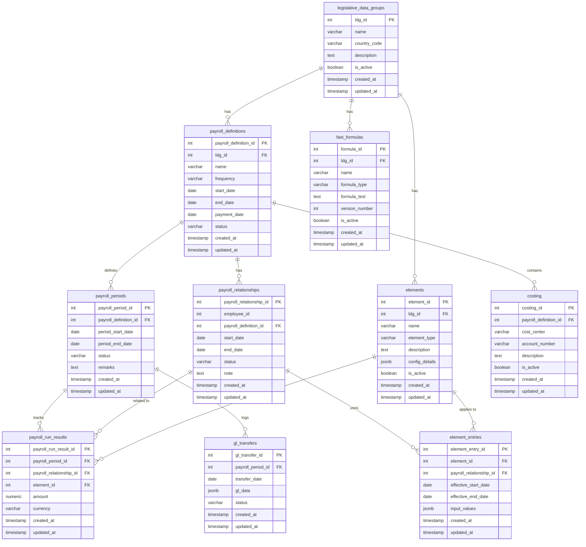

# Payroll Data Model
> Dưới đây là một ví dụ về thiết kế **DBML (Database Markup Language)** cho module Payroll dựa trên mô hình Oracle HCM. Mô hình được xây dựng với những thực thể (entities) cốt lõi như Legislative Data Group, Payroll Definition, Element, Payroll Relationship,... Bên cạnh đó, một số tính năng hiện đại của PostgreSQL hoặc các cải tiến từ phía middleware/Java library cũng được ghi chú để giúp hệ thống linh hoạt và hiệu quả hơn.

---

## 1. Sơ đồ DBML

```dbml
//================================================================
// 1. LEGISLATIVE_DATA_GROUP (LDG)
//================================================================
Table legislative_data_groups {
  ldg_id                int           [pk, increment] // Khóa chính, tự tăng
  name                  varchar(255)  // Tên của Legislative Data Group
  country_code          varchar(50)   // Mã quốc gia (VD: US, VN, JP...)
  description           text          // Mô tả chi tiết
  is_active             boolean       // Trạng thái còn hiệu lực (true/false)
  created_at            timestamp     [default: `now()`]
  updated_at            timestamp     [default: `now()`]
}

//================================================================
// 2. PAYROLL_DEFINITION
//================================================================
Table payroll_definitions {
  payroll_definition_id int           [pk, increment]
  ldg_id                int           [ref: > legislative_data_groups.ldg_id] 
  name                  varchar(255)  // Tên kỳ lương (VD: Monthly Payroll, Weekly Payroll)
  frequency             varchar(50)   // Tần suất (Monthly, Bi-weekly, Weekly...)
  start_date            date          // Ngày bắt đầu hiệu lực
  end_date              date          // Ngày kết thúc hiệu lực
  payment_date          date          // Ngày dự kiến trả lương
  status                varchar(50)   // Trạng thái (Active, Inactive...)
  created_at            timestamp     [default: `now()`]
  updated_at            timestamp     [default: `now()`]
}

//================================================================
// 3. PAYROLL_PERIOD
//================================================================
Table payroll_periods {
  payroll_period_id     int           [pk, increment]
  payroll_definition_id int           [ref: > payroll_definitions.payroll_definition_id]
  period_start_date     date          // Ngày bắt đầu kỳ lương
  period_end_date       date          // Ngày kết thúc kỳ lương
  status                varchar(50)   // Trạng thái (Open, Closed, etc.)
  remarks               text          // Ghi chú
  created_at            timestamp     [default: `now()`]
  updated_at            timestamp     [default: `now()`]
}

//================================================================
// 4. PAYROLL_RELATIONSHIP
//   Liên kết “lương” giữa nhân viên và Payroll Definition
//================================================================
Table payroll_relationships {
  payroll_relationship_id int         [pk, increment]
  employee_id             int         // ID của nhân viên (tham chiếu tới bảng nhân sự)
  payroll_definition_id   int         [ref: > payroll_definitions.payroll_definition_id]
  start_date              date
  end_date                date
  status                  varchar(50) // Trạng thái (Active, Suspended...)
  note                    text
  created_at              timestamp   [default: `now()`]
  updated_at              timestamp   [default: `now()`]
}

//================================================================
// 5. ELEMENT
//   Chứa thông tin về các loại khoản thu/khấu trừ (Earnings, Deductions, Tax…)
//================================================================
Table elements {
  element_id       int           [pk, increment]
  ldg_id           int           [ref: > legislative_data_groups.ldg_id]
  name             varchar(255)  // Tên của element (VD: Basic Salary, Bonus, Tax, Insurance…)
  element_type     varchar(50)   // Loại (Earnings, Deductions, Tax, Information)
  description      text          // Mô tả
  // Gợi ý cải tiến: Dùng cột JSONB nếu muốn lưu nhiều cấu hình linh hoạt cho element
  config_details   jsonb         // Lưu thêm cấu hình/đặc tính (tùy chọn)
  is_active        boolean       [default: true]
  created_at       timestamp     [default: `now()`]
  updated_at       timestamp     [default: `now()`]
}

//================================================================
// 6. ELEMENT_ENTRY
//   Bản ghi chi tiết element gán cho nhân viên, có thể chứa giá trị đầu vào (input values)
//================================================================
Table element_entries {
  element_entry_id       int           [pk, increment]
  element_id             int           [ref: > elements.element_id]
  payroll_relationship_id int          [ref: > payroll_relationships.payroll_relationship_id]
  effective_start_date   date
  effective_end_date     date
  // Gợi ý cải tiến: Lưu input values dưới dạng JSONB để có thể mở rộng
  input_values           jsonb         // Lưu các tham số (số giờ, số tiền, %…)
  created_at            timestamp      [default: `now()`]
  updated_at            timestamp      [default: `now()`]
}

//================================================================
// 7. FAST_FORMULAS
//   Chứa công thức tính toán. Có thể store text, JSONB, hoặc liên kết với rule engine bên ngoài
//================================================================
Table fast_formulas {
  formula_id     int           [pk, increment]
  ldg_id         int           [ref: > legislative_data_groups.ldg_id]
  name           varchar(255)
  formula_type   varchar(50)   // Loại công thức: Payroll Calculation, Validation, etc.
  formula_text   text          // Nội dung script (Fast Formula)
  // Gợi ý cải tiến: Lưu version, metadata, thậm chí store code trong GIT thay vì DB
  version_number int           [default: 1]
  is_active      boolean       [default: true]
  created_at     timestamp     [default: `now()`]
  updated_at     timestamp     [default: `now()`]
}

//================================================================
// 8. PAYROLL_RUN_RESULTS
//   Lưu kết quả tính lương cuối cùng cho mỗi nhân viên, mỗi Element, mỗi kỳ lương
//================================================================
Table payroll_run_results {
  payroll_run_result_id  int    [pk, increment]
  payroll_period_id      int    [ref: > payroll_periods.payroll_period_id]
  payroll_relationship_id int   [ref: > payroll_relationships.payroll_relationship_id]
  element_id             int    [ref: > elements.element_id]
  amount                 numeric(18,2) 
  currency               varchar(10)   // Mã tiền tệ (VD: USD, VND)
  // Gợi ý: Partition table theo payroll_period_id (hoặc theo năm/tháng) nếu data quá lớn
  created_at             timestamp     [default: `now()`]
  updated_at             timestamp     [default: `now()`]
}

//================================================================
// 9. COSTING
//   Thông tin hạch toán chi phí, liên kết với GL (General Ledger)
//================================================================
Table costing {
  costing_id            int           [pk, increment]
  payroll_definition_id int           [ref: > payroll_definitions.payroll_definition_id]
  cost_center           varchar(50)
  account_number        varchar(50)
  description           text
  is_active             boolean       [default: true]
  created_at            timestamp     [default: `now()`]
  updated_at            timestamp     [default: `now()`]
}

//================================================================
// 10. TRANSFER_TO_GL
//   Lưu trạng thái hoặc lịch sử transfer sang General Ledger
//================================================================
Table gl_transfers {
  gl_transfer_id    int         [pk, increment]
  payroll_period_id int         [ref: > payroll_periods.payroll_period_id]
  transfer_date     date
  gl_data           jsonb       // Có thể lưu thông tin hạch toán
  status            varchar(50) // (Pending, Completed…)
  created_at        timestamp   [default: `now()`]
  updated_at        timestamp   [default: `now()`]
}

//================================================================
// SƠ ĐỒ QUAN HỆ
//================================================================
Ref: legislative_data_groups.ldg_id < payroll_definitions.ldg_id
Ref: legislative_data_groups.ldg_id < elements.ldg_id
Ref: legislative_data_groups.ldg_id < fast_formulas.ldg_id

Ref: payroll_definitions.payroll_definition_id < payroll_periods.payroll_definition_id
Ref: payroll_definitions.payroll_definition_id < payroll_relationships.payroll_definition_id
Ref: payroll_definitions.payroll_definition_id < costing.payroll_definition_id

Ref: payroll_periods.payroll_period_id < payroll_run_results.payroll_period_id
Ref: payroll_periods.payroll_period_id < gl_transfers.payroll_period_id

Ref: payroll_relationships.payroll_relationship_id < element_entries.payroll_relationship_id
Ref: payroll_relationships.payroll_relationship_id < payroll_run_results.payroll_relationship_id

Ref: elements.element_id < element_entries.element_id
Ref: elements.element_id < payroll_run_results.element_id
```

---

## 2. Giải thích & Lưu ý mở rộng

1. **Legislative Data Group (LDG)**  
   - Bảng `legislative_data_groups` quản lý thông tin luật pháp, quy định của một quốc gia.  
   - Giúp phân biệt các chính sách tính lương, bảo hiểm, thuế,... theo quốc gia khác nhau.

2. **Payroll Definition**  
   - Bảng `payroll_definitions` cho phép định nghĩa các “kỳ lương” (khoảng thời gian, tần suất trả lương).  
   - Một LDG có thể có nhiều Payroll Definition (VD: Monthly cho khối văn phòng, Weekly cho công nhân theo giờ…).

3. **Payroll Period**  
   - Bảng `payroll_periods` lưu từng kỳ lương cụ thể (tháng 1, tháng 2...), liên kết 1-n với `payroll_definitions`.  
   - Mỗi kỳ sẽ có trạng thái (Open/Closed) và các thông tin (ngày bắt đầu/kết thúc).

4. **Payroll Relationship**  
   - Bảng `payroll_relationships` gắn một nhân viên với một Payroll Definition, chứa thời gian bắt đầu/kết thúc quan hệ “tính lương” (có thể do thay đổi hợp đồng, chuyển khối/bộ phận...).  

5. **Element & Element Entry**  
   - `elements` quản lý danh sách các loại khoản thu/khấu trừ.  
   - `element_entries` là “bản ghi” cụ thể gắn Element cho một nhân viên (thông qua payroll_relationships).  
   - Sử dụng cột `input_values` kiểu **JSONB** để linh hoạt lưu trữ các tham số cần thiết (số giờ, hệ số, %...).  

6. **Fast Formulas**  
   - Bảng `fast_formulas` lưu công thức tính lương, khấu trừ, thuế.  
   - Có thể lưu text, script, version... Dựa vào cột `formula_text`, kèm theo `formula_type`.  
   - **Cải tiến**: Dùng Git để version control, hoặc dùng 1 rule engine (Drools, Camunda…) nếu muốn tách logic ra khỏi DB.

7. **Payroll Run Results**  
   - Bảng `payroll_run_results` lưu kết quả tính lương (cho từng kỳ lương, từng nhân viên, từng element).  
   - **Cải tiến**: Với lượng dữ liệu rất lớn, có thể dùng Partition Table của PostgreSQL (theo `payroll_period_id` hoặc theo tháng/năm) để tối ưu hiệu suất.

8. **Costing & Transfer to GL**  
   - `costing` định nghĩa quy tắc phân bổ chi phí (mã tài khoản, cost center).  
   - `gl_transfers` lưu dữ liệu khi đã chuyển sang hệ thống kế toán (GL).  
   - **Cải tiến**: Tận dụng **Materialized View** hoặc **Foreign Data Wrapper** nếu cần tích hợp real-time với hệ thống kế toán bên ngoài.

---

## 3. Các gợi ý tối ưu & nâng cao (PostgreSQL, Java, Engine…)

1. **Dùng cột JSONB**  
   - Đối với các bảng như `elements`, `element_entries`, `gl_transfers`,… có thể lưu cấu hình hoặc giá trị linh hoạt (input_values, gl_data).  
   - PostgreSQL hỗ trợ **JSONB indexes** (GIN/GiST), cho phép query nhanh trên các field bên trong JSON.

2. **Partitioning**  
   - Bảng có khối lượng giao dịch lớn như `payroll_run_results` nên áp dụng **Partition Table** (theo tháng/quý/năm hoặc theo `payroll_period_id`).  
   - Giúp tăng tốc độ query, bảo trì (maintenance) và quản lý dữ liệu cũ.

3. **Indexes thông minh**  
   - Kết hợp **Partial Index** trên các cột hay truy vấn (VD: `status = 'Open'`) hoặc **BRIN Index** nếu bảng rất lớn, dữ liệu tính tuần tự theo thời gian.

4. **Rule Engine hoặc Service tách biệt**  
   - Thay vì lưu “formula_text” tĩnh trong DB, một số doanh nghiệp tách logic tính lương sang Java-based engine (Drools, Spring Boot + custom rules...).  
   - Cho phép thay đổi logic nhanh chóng, không cần can thiệp cấu trúc DB.

5. **Event-driven Architecture**  
   - Mỗi khi chạy Payroll Flow hoặc update Element Entry, có thể bắn sự kiện (Kafka, RabbitMQ) để xử lý đồng bộ hoá sang các hệ thống khác (GL, Time Attendance, BI...).  

6. **Bảo mật & Phân quyền**  
   - Kích hoạt **Row-Level Security (RLS)** trong PostgreSQL để phân quyền theo vai trò (Payroll Admin, Payroll Manager...).  
   - Mã hoá (encryption) ở mức cột (tên, lương nhân viên nhạy cảm) nếu cần.

---

## 4. Kết luận

Mô hình DBML trên mang tính tham khảo cho việc thiết kế cơ sở dữ liệu của module Payroll theo phong cách Oracle HCM. Tùy vào yêu cầu thực tế, quy mô dữ liệu, và hạ tầng kỹ thuật, ta có thể:

- Tận dụng tối đa các **tính năng mới của PostgreSQL** (JSONB, Partitioning, Indexing nâng cao, RLS...).  
- Tách logic phức tạp ra khỏi DB (dùng Java rule engine, microservices).  
- Thiết kế linh hoạt để có thể mở rộng (scalable) và dễ bảo trì (maintainable).  

Qua đó, hệ thống Payroll vừa phản ánh đầy đủ logic lõi (của Oracle HCM) vừa đón đầu được xu hướng kỹ thuật hiện đại, giúp tăng tính linh hoạt, hiệu suất và khả năng mở rộng trong tương lai.

